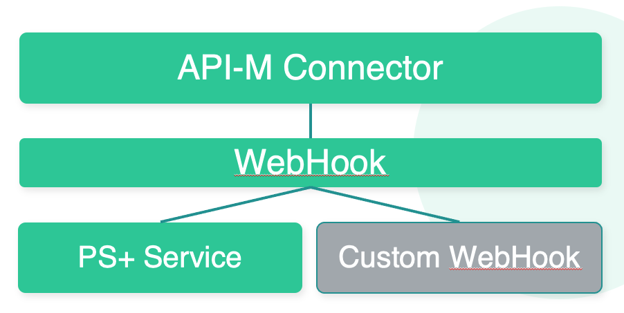

Overview of Organization Notifications and Notification Hub
===========================================================

As changes occur within other consumers may be interested in getting real-time notifications of changes. For example to synchronize Async APIs into other API Management Platforms.
Some use cases will require managed access adn event redistribution of change notifications emitted from the organization. This requirement is addressed by the "Notification Hub" - an additional, preconfigured organization that allows management of the Notifications as Async APIs.

Organization Notifications
--------------------------

An Organization registered in the connector can be configured to call a Web Hook on changes to resources.
Changes on any resource - such as API, API Product, Apps - are published to this webhook
The WebHook can be a PS+ Service or a Custom WebHook. 
Targetting a PS+ Service allows for event distribution to interested parties and the Notification Hub provides a template to provide access to notifications via Event Driven APIs.

Notification Hub
----------------

The Organization Notifications are described as a collection of Event Driven APIs.
One or more separate “Hub” organizations can be created with all required Async APIs and API Products.
It allows to manage Organization Events like any other Async APIs.

The Hub provides:

* Producer API

  * Allows to create apps that can act as producers of notifications

  * Includes ability to publish any type of Notification. 

* Consumer APIs

  * There are Async APIs for speparate groups of events
  
  * Allows to offer specific notifications as API Products for consuming applications.

.. image:: ./assets/notification_hub_flows.png
